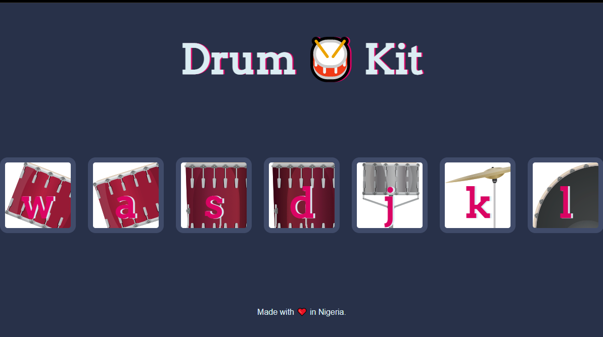

# Drum-Kit
I made a drum kit using HTML CSS and JAVASCRIPT

### Screenshot

### Links

- Solution URL: [https://github.com/Teke111/Drum-Kit]
- Live Site URL: [https://teke111.github.io/Drum-Kit/]

## My process

### Built with

- Semantic HTML5 markup
- CSS custom properties
- Javascript

